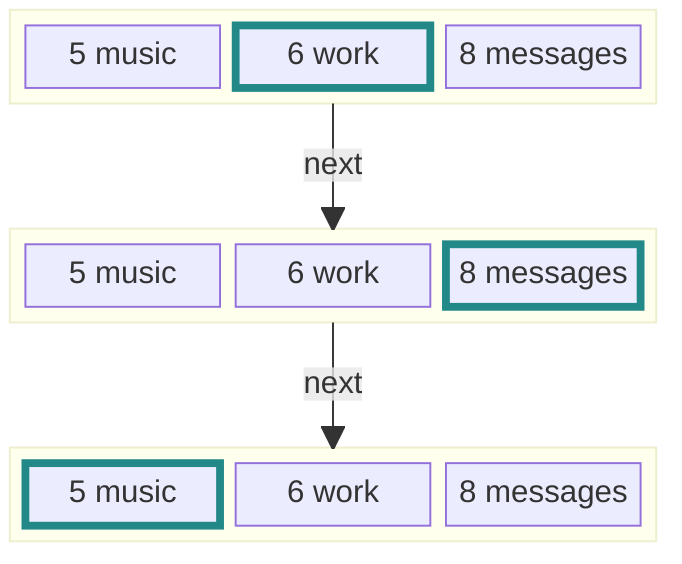
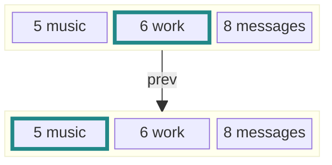
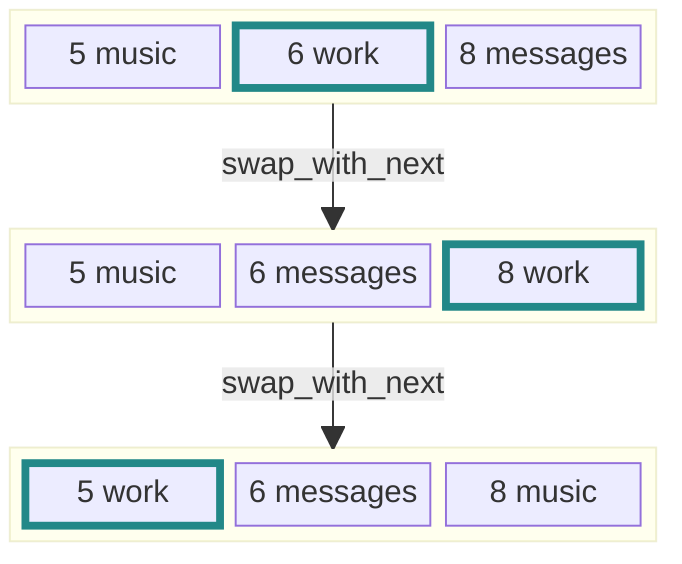
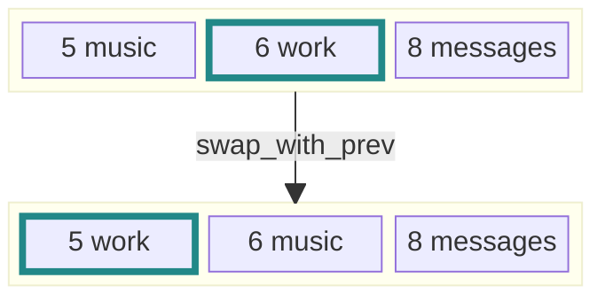
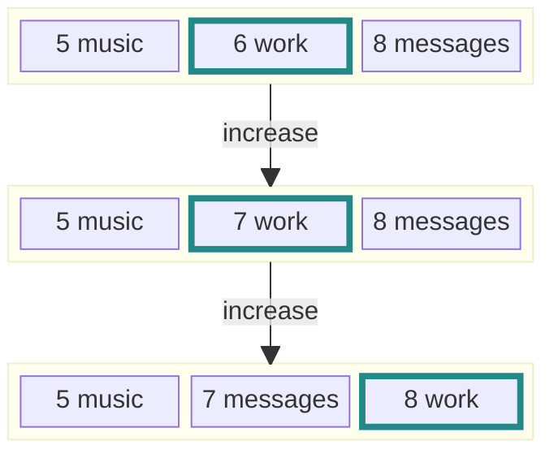
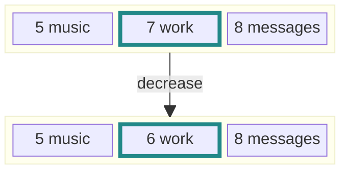
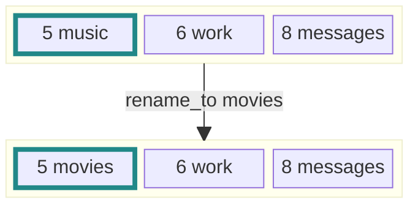
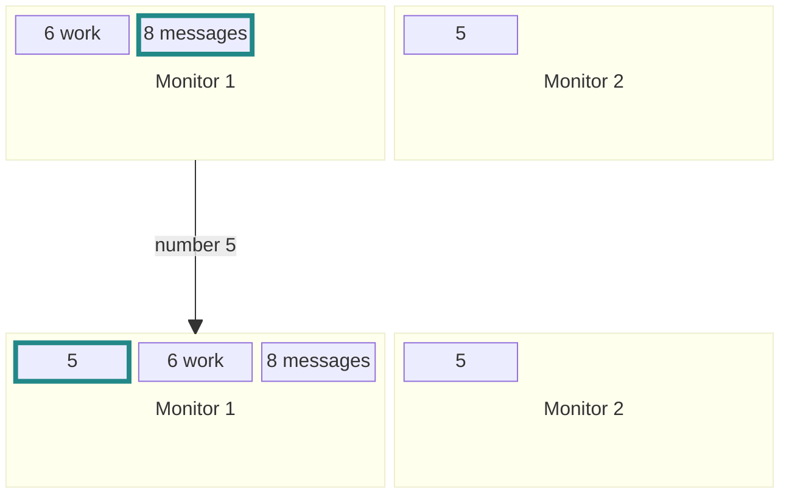
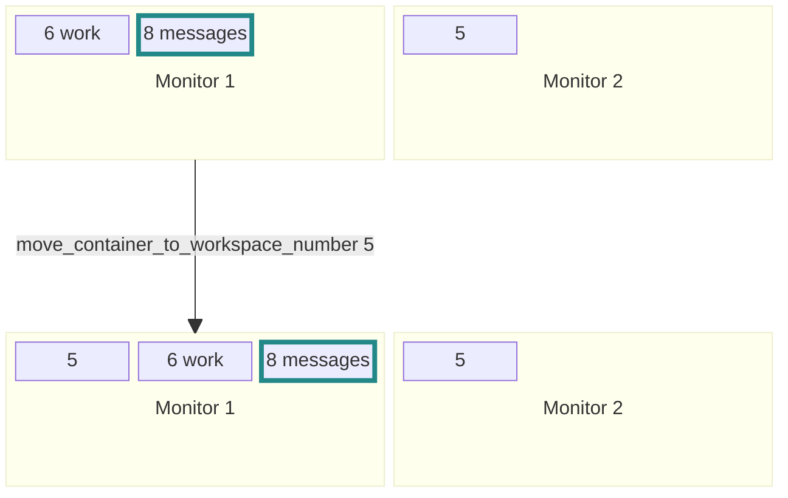

# `swaymsg_workspace`: A Better Way to Manage Sway Workspaces

This tool improves workspace management in [Sway](https://swaywm.org/) by making workspace switching, reordering, and renaming easier—especially when using multiple monitors.

---

## 🔧 What It Does

- **Switch workspaces** (like `workspace next`) but stays on the **focused monitor**
- **Reorder** workspaces left/right—just like browser tabs
- **Rename** workspaces without losing their numbers
- Integrates with **Rofi** for quick workspace selection and renaming

---

## 💡 Why Use It?

### Problem with Default Sway Behavior
When using multiple monitors, Sway’s built-in `workspace next` jumps to a different monitor. Or even cycles backwards through Workspaces. That’s confusing!

##### Comparison to Sway stock behaviour:

<table style="margin-left: auto; margin-right: auto;">
<tr><th> 
  Default Sway (moves across monitors)
</th><th> 
  swaymsg_workspace (stays on current monitor)
</th></tr>
<tr><td>
&nbsp;&nbsp;&nbsp;

<table style="margin-left: auto; margin-right: auto;">
<tr><th colspan=2>Monitor1 </th><th> Monitor2 </th></tr>
<tr><td align="center"><ins>▪ 6 work </ins></td><td align="center"><sup>▫ 8 messages </sup></td><td align="center"><sup>▫ 7 music</sup></td></tr>
<tr><td colspan=3 align="center">
  
  ```next```
  
</td></tr>
<tr><td align="center"><sup>▫ 6 work </sup></td><td align="center"><sup>▫ 8 messages </sup></td><td align="center"><ins>▪ 7 music</ins></ins></tr>
<tr><td colspan=3 align="center">
  
  ```next```
  
  </td></tr>
<tr><td align="center"><sup>▫ 6 work </sup></td><td align="center"><ins>▪ 8 messages </ins></td><td align="center"><sup>▫ 7 music</sup></td></tr>
<tr style="text-align: center; border: none!important;"><td colspan=3 style="text-align: center; border: none!important;" align="center">
  
  ```next```
  
</td></tr>
<tr><td align="center"><ins>▪ 6 work </ins></td><td align="center"><sup>▫ 8 messages </sup></td><td align="center"><sup>▫ 7 music</sup></td></tr>
</table>

&nbsp;&nbsp;&nbsp;
</td><td>
&nbsp;&nbsp;&nbsp;

<table style="margin-left: auto; margin-right: auto;">
<tr><th colspan=2>Monitor1 </th><th> Monitor2 </th></tr>
<tr><td align="center"><ins>▪ 6 work </ins></td><td align="center"><sup>▫ 8 messages </sup></td><td align="center"><sup>▫ 7 music</sup></td></tr>
<tr><td colspan=3 align="center">
  
  ```next```
  
</td></tr>
<tr><td align="center"><sup>▫ 6 work </sup></td><td align="center"><ins>▪ 8 messages </ins></td><td align="center"><sup>▫ 7 music</sup></td></tr>
<tr style="text-align: center; border: none!important;"><td colspan=3 style="text-align: center; border: none!important;" align="center">
  
  ```next```
  
</td></tr>
<tr><td align="center"><ins>▪ 6 work </ins></td><td align="center"><sup>▫ 8 messages </sup></td><td align="center"><sup>▫ 7 music</sup></td></tr>
<tr style="text-align: center; border: none!important;"><td colspan=3 style="text-align: center; border: none!important;" align="center">
  
  ```next```
  
</td></tr>
<tr><td align="center"><sup>▫ 6 work </sup></td><td align="center"><ins>▪ 8 messages </ins></td><td align="center"><sup>▫ 7 music</sup></td></tr>
</table>

&nbsp;&nbsp;&nbsp;
</td></tr> </table>

---

## ✨ Features Overview

| Feature | What it does |
|--------|--------------|
| - General Commands <Argument> | Limited to current Output |
| | |
| `next`, `prev` | [Go to next/previous workspace on the same monitor](#select-workspace) |
| `swap_with_next`, `swap_with_prev` | [Reorder current workspace left/right on the same monitor](#swap-workspace) |
| `increase`, `decrease` | [Reassign workspace to next/previous number](#index-workspace) |
| `rename_to <name>` | [Rename a workspace but keep its number](#rename-workspace) |
| `number <n>` | [Go to workspace `<n>` on the same monitor](#select-workspace-while-multiple-monitors-are-connected) |
| `move_container_to_workspace_number <n>` | [Move focused window to workspace `<n>` on same monitor](#move-window-to-workspace-number-while-multiple-monitors-are-connected) |
| | |
| - Rofi integration Commands <Argument> | Across all Outputs |
| | |
| `rofi_select_workspace` | print unique names of all Workspaces |
| `rofi_select_workspace <unique name>` | Select Workspace by unique name |
| `select <unique name>` | Alias for `rofi_select_workspace <unique name>` |
| `rofi_move_window` | print unique names of all Workspaces |
| `rofi_move_window <unique name>` | Move Container to Workspace idetified by unique name |

##### Select workspace
```
~/.cargo/bin/swaymsg_workspace next
```

```
~/.cargo/bin/swaymsg_workspace prev
```

##### Swap workspace
```
~/.cargo/bin/swaymsg_workspace swap_with_next
```

```
~/.cargo/bin/swaymsg_workspace swap_with_prev
```

##### Index workspace
```
~/.cargo/bin/swaymsg_workspace increase
```

```
~/.cargo/bin/swaymsg_workspace decrease
```

##### Rename workspace
```
~/.cargo/bin/swaymsg_workspace rename_to movies
```

##### Select workspace while multiple monitors are connected
```
~/.cargo/bin/swaymsg_workspace number 5
```

##### Move window to workspace number while multiple monitors are connected
```
~/.cargo/bin/swaymsg_workspace move_container_to_workspace_number 5
```


---

## 🚀 Quick Start

#### 1. install Rust


   Visit: https://www.rust-lang.org/tools/install
   
   Rust includes ```cargo``` and ```rustup```.

#### 2. Use Rust Nightly
   ```sh
   rustup override set nightly
   ```

#### 3. Install the Tool
   ```sh
   cargo install --git https://github.com/berezowski/swaymsg_workspace
   ```
   Binary will be at:
   ```~/.cargo/bin/swaymsg_workspace```

## ⚙️ Sway Config Example

Add these bindings to your ```~/.config/sway/config```:
  
   ```
   ### swaymsg_workspace select previous / next
   bindsym Mod1+Ctrl+n exec ~/.cargo/bin/swaymsg_workspace next
   bindsym Mod1+Ctrl+p exec ~/.cargo/bin/swaymsg_workspace prev
   
   ### swaymsg_workspace move workspace left / right
   bindsym Mod1+Ctrl+Shift+n exec ~/.cargo/bin/swaymsg_workspace swap_with_next
   bindsym Mod1+Ctrl+Shift+p exec ~/.cargo/bin/swaymsg_workspace swap_with_prev

   ### swaymsg_workspace increase / decrease number
   bindsym Mod1+Ctrl+v exec ~/.cargo/bin/swaymsg_workspace decrease
   bindsym Mod1+Ctrl+Shift+v exec ~/.cargo/bin/swaymsg_workspace increase

   ### swaymsg_workspace select by number
   bindsym Mod1+Ctrl+0 exec ~/.cargo/bin/swaymsg_workspace number 10
   bindsym Mod1+Ctrl+1 exec ~/.cargo/bin/swaymsg_workspace number 1
   bindsym Mod1+Ctrl+2 exec ~/.cargo/bin/swaymsg_workspace number 2
   bindsym Mod1+Ctrl+3 exec ~/.cargo/bin/swaymsg_workspace number 3
   bindsym Mod1+Ctrl+4 exec ~/.cargo/bin/swaymsg_workspace number 4
   bindsym Mod1+Ctrl+5 exec ~/.cargo/bin/swaymsg_workspace number 5
   bindsym Mod1+Ctrl+6 exec ~/.cargo/bin/swaymsg_workspace number 6
   bindsym Mod1+Ctrl+7 exec ~/.cargo/bin/swaymsg_workspace number 7
   bindsym Mod1+Ctrl+8 exec ~/.cargo/bin/swaymsg_workspace number 8
   bindsym Mod1+Ctrl+9 exec ~/.cargo/bin/swaymsg_workspace number 9

   ### swaymsg_workspace move container to workspace number
   bindsym Mod1+Ctrl+Shift+0 exec ~/.cargo/bin/swaymsg_workspace move_container_to_workspace_number 10
   bindsym Mod1+Ctrl+Shift+1 exec ~/.cargo/bin/swaymsg_workspace move_container_to_workspace_number 1
   bindsym Mod1+Ctrl+Shift+2 exec ~/.cargo/bin/swaymsg_workspace move_container_to_workspace_number 2
   bindsym Mod1+Ctrl+Shift+3 exec ~/.cargo/bin/swaymsg_workspace move_container_to_workspace_number 3
   bindsym Mod1+Ctrl+Shift+4 exec ~/.cargo/bin/swaymsg_workspace move_container_to_workspace_number 4
   bindsym Mod1+Ctrl+Shift+5 exec ~/.cargo/bin/swaymsg_workspace move_container_to_workspace_number 5
   bindsym Mod1+Ctrl+Shift+6 exec ~/.cargo/bin/swaymsg_workspace move_container_to_workspace_number 6
   bindsym Mod1+Ctrl+Shift+7 exec ~/.cargo/bin/swaymsg_workspace move_container_to_workspace_number 7
   bindsym Mod1+Ctrl+Shift+8 exec ~/.cargo/bin/swaymsg_workspace move_container_to_workspace_number 8
   bindsym Mod1+Ctrl+Shift+9 exec ~/.cargo/bin/swaymsg_workspace move_container_to_workspace_number 9

   ```

## 🧠 Rofi Integration

Use ```rofi``` to rename or select workspaces:
#### Sway Config:
```
bindsym --release Mod1+Ctrl+space exec /usr/bin/rofi -show combi
bindsym Mod1+Ctrl+r exec ~/.cargo/bin/swaymsg_workspace rename_to $(rofi -dmenu -l 0 -P "rename workspace $(~/.cargo/bin/swaymsg_workspace print_focused_name) to")
```

#### Rofi Config (~/.config/rofi/config.rasi)

```
configuration {
  modi: "combi,move to workspace:~/.cargo/bin/swaymsg_workspace rofi_move_window";
  font: "M+CodeLat60 Nerd Font Mono 12";
  combi-modi: "workspaces:~/.cargo/bin/swaymsg_workspace rofi_select_workspace,window,drun,ssh";
  kb-mode-next: "Control+Alt+space";
}

```

## 🖱️ useful in this context: focusing monitors

```
bindsym Mod1+Ctrl+m focus output right, focus child
bindsym Mod1+Ctrl+m+Shift move workspace to output right

bindsym Mod1+Ctrl+u focus output up, focus child
bindsym Mod1+Ctrl+u+Shift move workspace to output up

bindsym Mod1+Ctrl+Mod4+h move workspace to output left
bindsym Mod1+Ctrl+Mod4+j move workspace to output down
bindsym Mod1+Ctrl+Mod4+k move workspace to output up
bindsym Mod1+Ctrl+Mod4+l move workspace to output right
```

---

## 📺 Demo
https://github.com/user-attachments/assets/7169c4ec-6c15-4ab4-a7ec-35b221379996
