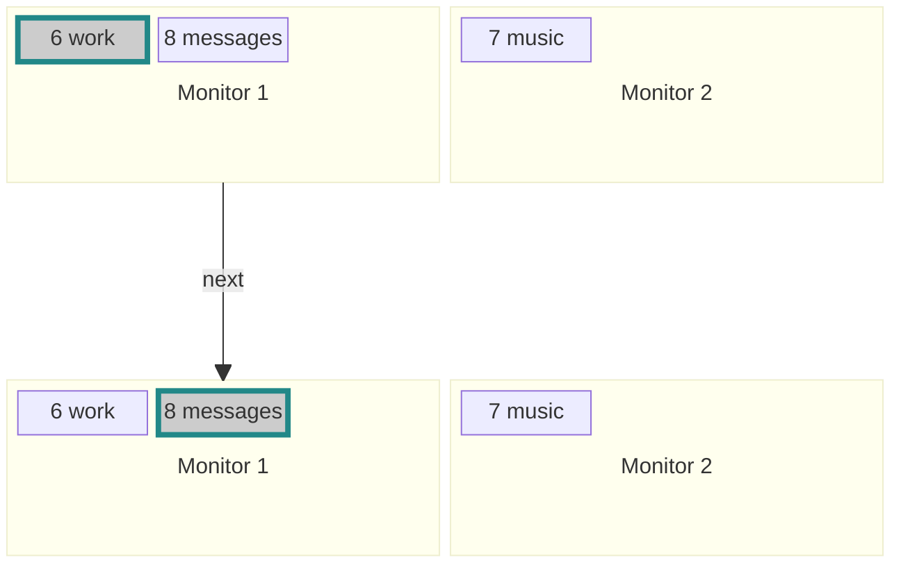
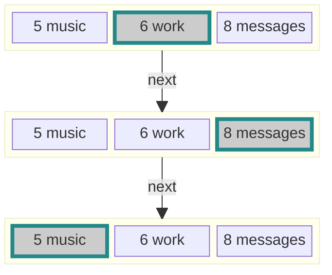
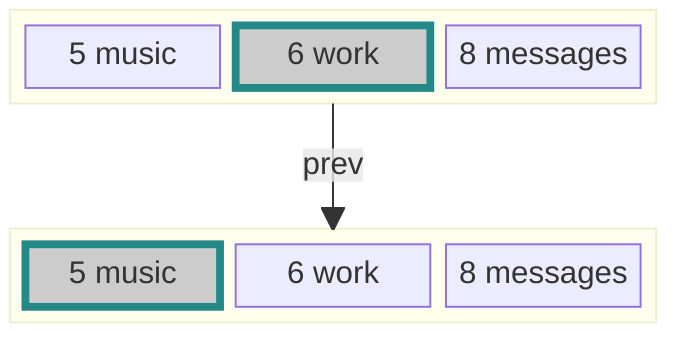
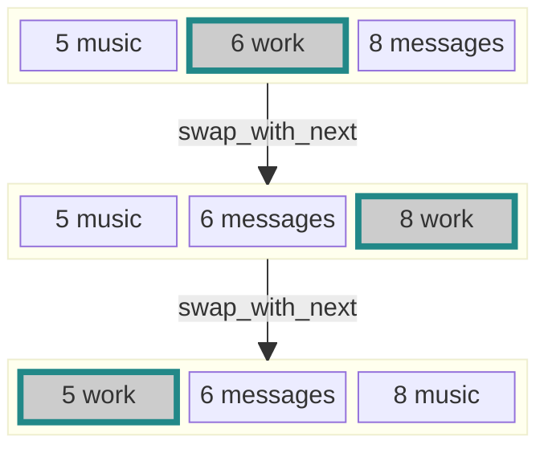
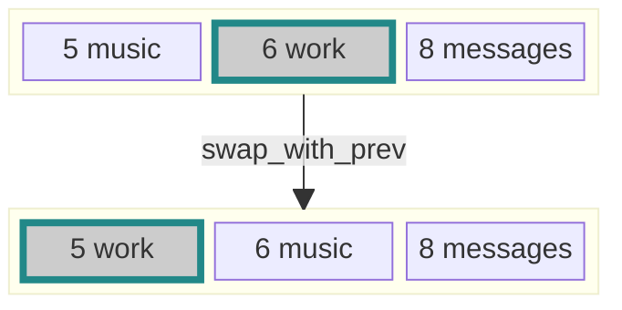
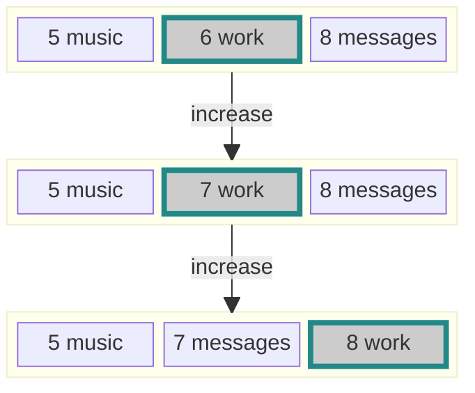
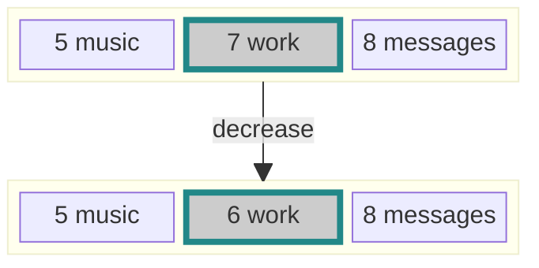
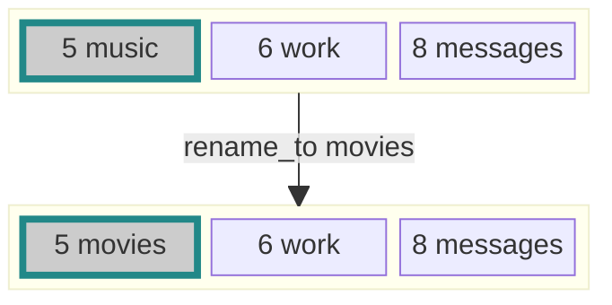
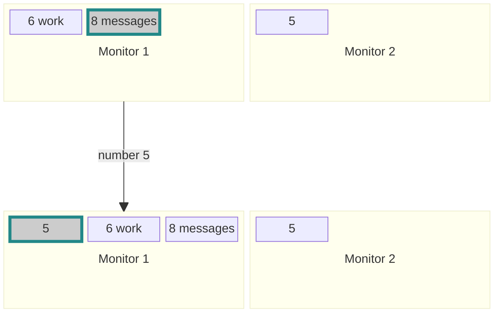
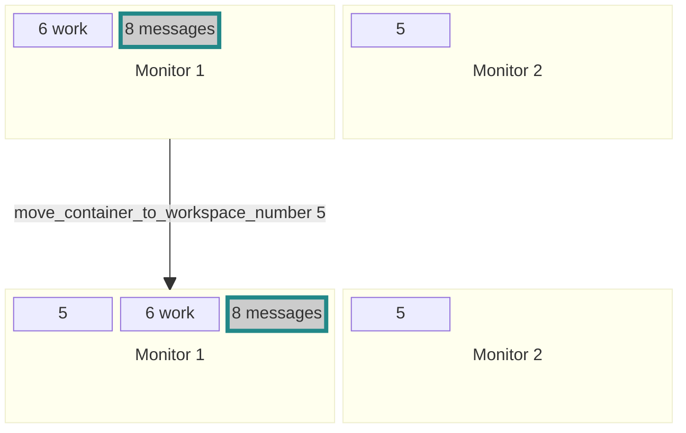

# SWAY workspace manipulation helper
Less confusing rename, switch, or reorder workspaces.\
switch: This program tries very hard to keep all workspace operations on the focused monitor.\
reorder: Move workspaces left/right like container tabs in Sway.\
rename: Renaming remembers the workspace number.\
Also, it serves as a binary for selecting or renaming workspaces in rofi.

##### e.g. Next workspace while multiple monitors are connected
```
~/.cargo/bin/swaymsg_workspace next
```


##### Sway stock behaviour:

Given the workspaces:
| Monitor1 | Monitor1 |Monitor2|
| --- | --- | --- |
| ▫ 6 work | ▪ 8 messages|▫ 7 music


with ```▪ 8 messages``` *Monitor 1* being focused

calling Sway's "workspace next" would switch focus to


```▪ 6 work``` *Monitor 1* &nbsp;&nbsp;&nbsp;&nbsp; "workspace next" &nbsp;&nbsp;&nbsp;&nbsp;```▪ 7 music``` *Monitor 2* &nbsp;&nbsp;&nbsp;&nbsp; "workspace next" &nbsp;&nbsp;&nbsp;&nbsp;```▪ 8 messages``` *Monitor 1*

## Features
- [next/prev command to select adjacent Workspaces on the same monitor, (unlike sway's 'workspace next' command) ](#select-workspace)
- [swap current workspace with previous / next workspace on the currently active monitor](#swap-workspace)
- [reorder workspaces by increasing/decreasing workspace Number](#index-workspace)
- [rename a workspace without changing the workspace Number](#rename-workspace)
- rename/select workspace via rofi
- [select workspace by number on same output](#select-workspace-while-multiple-monitors-are-connected)
- [move window to workspace on same output](#move-window-to-workspace-number-while-multiple-monitors-are-connected)


##### Select workspace
```
~/.cargo/bin/swaymsg_workspace next
```

```
~/.cargo/bin/swaymsg_workspace prev
```

##### Swap workspace
```
~/.cargo/bin/swaymsg_workspace swap_with_next
```

```
~/.cargo/bin/swaymsg_workspace swap_with_prev
```

##### Index workspace
```
~/.cargo/bin/swaymsg_workspace increase
```

```
~/.cargo/bin/swaymsg_workspace decrease
```

##### Rename workspace
```
~/.cargo/bin/swaymsg_workspace rename_to movies
```

##### Select workspace while multiple monitors are connected
```
~/.cargo/bin/swaymsg_workspace number 5
```

##### Move window to workspace number while multiple monitors are connected
```
~/.cargo/bin/swaymsg_workspace move_container_to_workspace_number 5
```


___
## Demo
https://github.com/user-attachments/assets/7169c4ec-6c15-4ab4-a7ec-35b221379996

## Installation

1. #### install Rust
   https://www.rust-lang.org/tools/install

   The Rust installer comes with 'rustup' and 'cargo'.

2. #### switch to rust nightly channel
   ```
   rustup override set nightly
   ```

3. #### Build and install binary
   ```
   cargo install --git https://github.com/berezowski/swaymsg_workspace
   ```
   The compiled binary should be in 
   ```~/.cargo/bin/swaymsg_workspace```


4. #### edit sway config
   ```> grep swaymsg_workspace ~/.config/sway/config```
   ```
   ### swaymsg_workspace select previous / next
   bindsym Mod1+Ctrl+n exec ~/.cargo/bin/swaymsg_workspace next
   bindsym Mod1+Ctrl+p exec ~/.cargo/bin/swaymsg_workspace prev
   
   ### swaymsg_workspace move workspace left / right
   bindsym Mod1+Ctrl+Shift+n exec ~/.cargo/bin/swaymsg_workspace swap_with_next
   bindsym Mod1+Ctrl+Shift+p exec ~/.cargo/bin/swaymsg_workspace swap_with_prev

   ### swaymsg_workspace increase / decrease number
   bindsym Mod1+Ctrl+f exec ~/.cargo/bin/swaymsg_workspace decrease
   bindsym Mod1+Ctrl+g exec ~/.cargo/bin/swaymsg_workspace increase

   ### swaymsg_workspace select by number
   bindsym Mod1+Ctrl+0 exec ~/.cargo/bin/swaymsg_workspace number 10
   bindsym Mod1+Ctrl+1 exec ~/.cargo/bin/swaymsg_workspace number 1
   bindsym Mod1+Ctrl+2 exec ~/.cargo/bin/swaymsg_workspace number 2
   bindsym Mod1+Ctrl+3 exec ~/.cargo/bin/swaymsg_workspace number 3
   bindsym Mod1+Ctrl+4 exec ~/.cargo/bin/swaymsg_workspace number 4
   bindsym Mod1+Ctrl+5 exec ~/.cargo/bin/swaymsg_workspace number 5
   bindsym Mod1+Ctrl+6 exec ~/.cargo/bin/swaymsg_workspace number 6
   bindsym Mod1+Ctrl+7 exec ~/.cargo/bin/swaymsg_workspace number 7
   bindsym Mod1+Ctrl+8 exec ~/.cargo/bin/swaymsg_workspace number 8
   bindsym Mod1+Ctrl+9 exec ~/.cargo/bin/swaymsg_workspace number 9

   ### swaymsg_workspace move container to workspace number
   bindsym Mod1+Ctrl+Shift+0 exec ~/.cargo/bin/swaymsg_workspace move_container_to_workspace_number 10
   bindsym Mod1+Ctrl+Shift+1 exec ~/.cargo/bin/swaymsg_workspace move_container_to_workspace_number 1
   bindsym Mod1+Ctrl+Shift+2 exec ~/.cargo/bin/swaymsg_workspace move_container_to_workspace_number 2
   bindsym Mod1+Ctrl+Shift+3 exec ~/.cargo/bin/swaymsg_workspace move_container_to_workspace_number 3
   bindsym Mod1+Ctrl+Shift+4 exec ~/.cargo/bin/swaymsg_workspace move_container_to_workspace_number 4
   bindsym Mod1+Ctrl+Shift+5 exec ~/.cargo/bin/swaymsg_workspace move_container_to_workspace_number 5
   bindsym Mod1+Ctrl+Shift+6 exec ~/.cargo/bin/swaymsg_workspace move_container_to_workspace_number 6
   bindsym Mod1+Ctrl+Shift+7 exec ~/.cargo/bin/swaymsg_workspace move_container_to_workspace_number 7
   bindsym Mod1+Ctrl+Shift+8 exec ~/.cargo/bin/swaymsg_workspace move_container_to_workspace_number 8
   bindsym Mod1+Ctrl+Shift+9 exec ~/.cargo/bin/swaymsg_workspace move_container_to_workspace_number 9

   ```

#### rofi config
```> grep rofi ~/.config/sway/config```
```
bindsym --release Mod1+Ctrl+space exec /usr/bin/rofi -show combi
bindsym Mod1+Ctrl+r exec ~/.cargo/bin/swaymsg_workspace rename_to $(rofi -dmenu -l 0 -P "rename workspace $(~/.cargo/bin/swaymsg_workspace print_focused_name) to")
```


```> cat ~/.config/rofi/config.rasi```
```
configuration {
  modi: "combi,move to workspace:~/.cargo/bin/swaymsg_workspace rofi_move_window";
  font: "M+CodeLat60 Nerd Font Mono 12";
  combi-modi: "workspaces:~/.cargo/bin/swaymsg_workspace rofi_select_workspace,window,drun,ssh";
  kb-mode-next: "Control+Alt+space";
}

```

#### useful in this context: focusing monitors
```> cat .config/sway/config |grep output```
```
bindsym Mod1+Ctrl+m focus output right
bindsym Mod1+Ctrl+m+Shift move workspace to output right

bindsym Mod1+Ctrl+u focus output up
bindsym Mod1+Ctrl+u+Shift move workspace to output up

bindsym Mod1+Ctrl+Mod4+h move workspace to output left
bindsym Mod1+Ctrl+Mod4+j move workspace to output down
bindsym Mod1+Ctrl+Mod4+k move workspace to output up
bindsym Mod1+Ctrl+Mod4+l move workspace to output right
```
